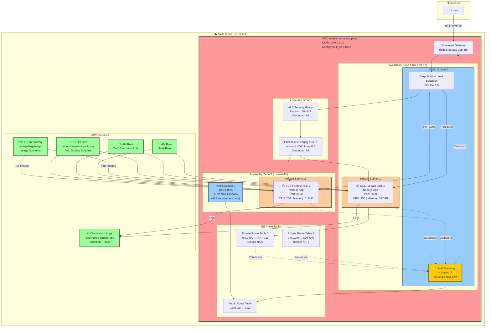
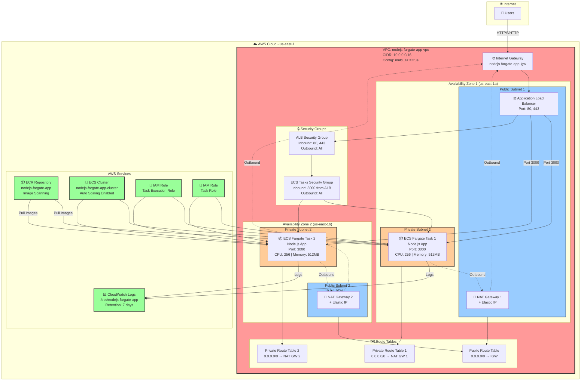

# AWS ECS Fargate Architecture - Mermaid Diagram

This diagram can be rendered in GitHub, GitLab, or any Mermaid-compatible viewer.

# Single-AZ Configuration (Development)

**Configuration**: `multi_az = false` (Single NAT Gateway)



---

# Multi-AZ Configuration (Production)

**Configuration**: `multi_az = true` (Two NAT Gateways)



## Architecture Components

### 🌐 Internet Layer
- **Users**: External users accessing the application

### ☁️ VPC Layer
- **VPC**: Main virtual network (10.0.0.0/16)
- **Internet Gateway**: Provides internet access
- **Public Subnets**: Host NAT Gateways and ALB
- **Private Subnets**: Host ECS Fargate tasks

### ⚖️ Load Balancing Layer
- **Application Load Balancer**: Distributes traffic across tasks
- **Target Group**: Routes to healthy tasks on port 3000

### 📦 Compute Layer
- **ECS Fargate Tasks**: Containerized Node.js applications
- **Auto Scaling**: Scales based on CPU/Memory utilization

### 🔒 Security Layer
- **Security Groups**: Firewall rules for ALB and ECS tasks
- **IAM Roles**: Permissions for task execution and application access

### 📊 Observability Layer
- **CloudWatch Logs**: Centralized logging
- **CloudWatch Metrics**: Performance monitoring

### 🗄️ Storage Layer
- **ECR**: Container image repository

## Traffic Flow

### Inbound (User → Application)
```
Users → Internet Gateway → ALB → ECS Tasks (Private Subnets)
```

### Outbound (Application → Internet)
```
ECS Tasks → NAT Gateway → Internet Gateway → Internet
```

## Configuration Modes

### Single-AZ Mode (Development) - `multi_az = false`
- ✅ **1 NAT Gateway** (~$32/month)
- ✅ Cost-optimized for development
- ✅ Both private subnets route through single NAT Gateway
- ⚠️ Less redundancy (single NAT Gateway)

### Multi-AZ Mode (Production) - `multi_az = true`
- ✅ **2 NAT Gateways** (~$64/month)
- ✅ High availability and redundancy
- ✅ Each private subnet uses its own NAT Gateway
- ✅ Production-grade setup

## High Availability Features

### Single-AZ Mode:
- ✅ Load balancing across multiple tasks
- ✅ Auto-scaling based on demand
- ✅ Health checks and automatic failover
- ⚠️ Single NAT Gateway (cost savings)

### Multi-AZ Mode:
- ✅ Multi-AZ deployment (2 Availability Zones)
- ✅ Load balancing across multiple tasks
- ✅ Auto-scaling based on demand
- ✅ Health checks and automatic failover
- ✅ Redundant NAT Gateways
